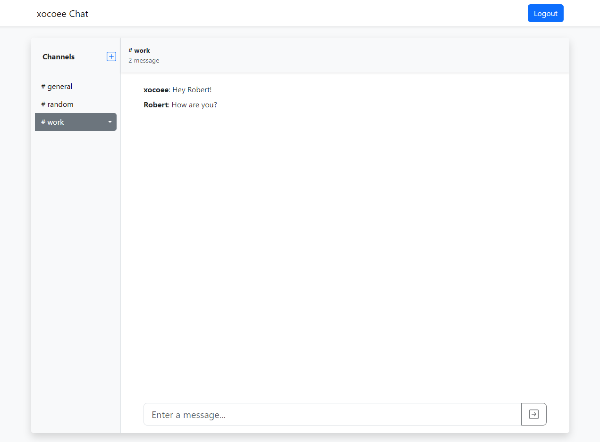

# Project "Chat"

## Project Description:
Chat is a versatile chat application that lets you create and join private rooms to talk with friends or participate in the public room, #general, to chat with everyone.
### Features
Signup / Login
Live Chat with sockets
Managing channels (add, remove, rename);
Auto scroll chat view

## Link: [click](https://frontend-project-12-njkc.onrender.com)

## Install app
```sh
git clone https://github.com/xocoee/chat.git
cd chat
make install
```
```sh
make start
```

## Demonstration
